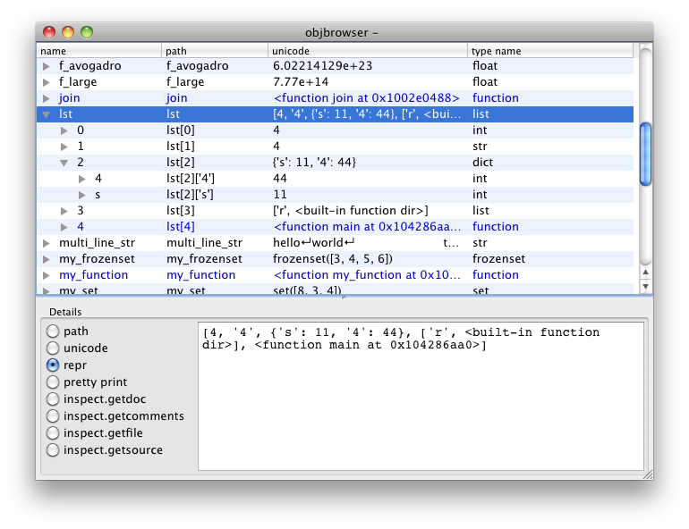

objbrowser
==========

Extensible Python object inspection tool implemented in Qt.

Displays objects as trees and allows you to inspect their attributes
recursively (e.g. browse through a list of dictionaries). You can add 
your own inspection methods as new columns to the tree view, or as radio buttons
to the details pane. Altering existing inspection methods is possible as well.


### Installation:

1.	Install
	    [PySide](http://wiki.qt.io/Category:LanguageBindings::PySide::Downloads)
    or
	    [PyQt4](https://www.riverbankcomputing.com/software/pyqt/download).

2.	Run the installer:
```
%> pip install objbrowser
```

### User interface:




From the _View_ menu you can select some extra columns, for instance the 
object's _id_ column. This can also be done by right-clicking on the table
header. An overview of the available columns, and their meanings, can be
found in [here](columns.md).

Callable objects (typically functions, methods and classes) are displayed
in blue. Objects that are an attribute of their parent (as opposed to a
list element or dictionary item) are displayed in _italics_.

If _Show callable attributes_ from the _View_ menu is checked, objects
that are callable and are an attribute are shown. Otherwise they are hidden.

If _Show special attributes_ from the _View_ menu is checked, objects
that are attributes, and have a name that starts and ends with two
underscores, are shown. Otherwise they are hidden.

The details pane at the bottom shows object properties that do not fit
on one line, such as the docstrings and the output of various functions 
of the `inspect` module from the Python standard library.


### Usage examples:

The first parameter is the object to be inspected. For example you can 
examine the dictionary with the local variables:

```Python
from objbrowser import browse
a = 67; pi = 3.1415 
browse(locals())
```

The second parameter can be the name of the object. In that case the object
itself will be displayed in the root node.

```Python
browse(locals(), 'locals()')
```

By setting the `show_callable_attributes` and/or the `show_special_attributes`
parameters you can override the settings from the _View_ menu. The `reset`
parameter resets the persistent window settings (e.g. size and position)

```Python
s1 = 'Hello'
s2 = 'World'

browse({'s1': s1, 's2': s2}, 
        show_callable_attributes = True,
        show_special_attributes = False, 
        reset = True)
```

Some complete examples can be found in the [examples directory](examples). E.g.:

* [Define your own column](examples/simple_add_column.py)
* [Override the summary column](examples/override_summary.py)
* [Show two browser windows simultaneously](examples/modules.py)
